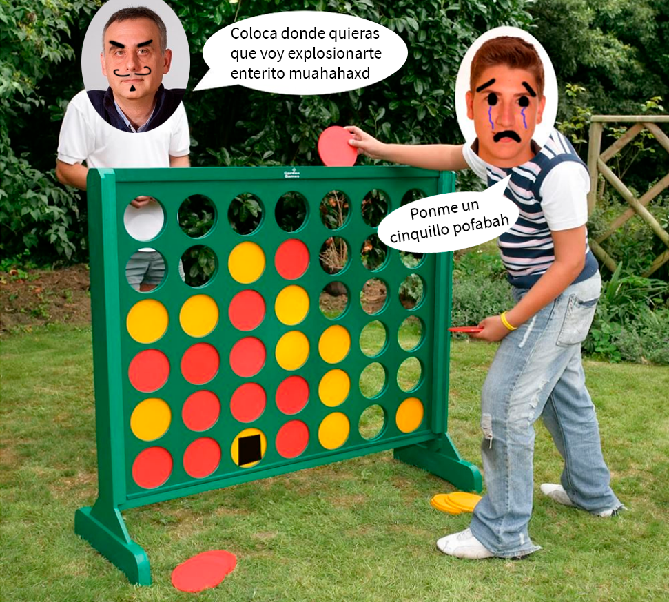

# Desconecta4 BOOM

##### David Gil Bautista

##### 45925324M

##### [Contacto](mailto:davidgilbautista@gmail.com)

## Índice

#### [Introducción y análisis del problema](#id1)

#### [Poda Alfa-Beta](#id2)

#### [Función de valoración](#id3)

#### [Conclusión](#id4)

## Introducción y análisis del problema

Para el desarrollo y resolución de esta práctica se nos presenta un juego de información perfecta en el que debemos ganar a diversos adversarios. El juego es similar al mítico 4 en raya, pero en este caso debemos conseguir que sea el oponente el que coloque 4 fichas consecutivas. Adicionalmente se introduce un nuevo concepto, las fichas bomba, que nos ayudarán a eliminar todas las fichas de un color de una fila determinada.

## Poda Alfa-Beta

Para resolver este juego he optado por implementar una poda alfabeta con una profundidad límite de 8 niveles. Para esta función he usado una función recursiva que recorre el árbol de posibles jugadas expandiendo los valores de alfa y beta, una vez llegados a un nodo hoja o al límite de la profundidad se comprueban los valores del nodo y en consecuencia modificamos alfa o beta. Conforme vamos expandiendo el árbol los valores de poda son más restrictivos por lo que evitamos recorrer ramas que nunca van a ser recorridas.

## Función de valoración

Para darle un valor a cada estado uso una función en la que recorro todas las posiciones y desde cada una de ellas compruebo las fichas adyacentes horizontales, verticales y diagonales. Primero compruebo si se han juntado 4 fichas horizontal, vertical o diagonalmente, en caso de cumplirse devuelvo un número grande, en caso de que sean 3 devuelvo otro más pequeño y por último, si son 2 devuelvo otro más pequeño aún. Haciendo esto compruebo en cada posición la peor/mejor jugada y con esta comprobación actualizo la puntuación total del tablero.

## Conclusión

El desarrollo de esta práctica ha sido un tanto curioso, empecé copiando la implementación de hace varios años, en esa implementación conseguía ganar a bastantes oponentes en mi clase, aún no sé cómo, porque explorando el código he encontrado multitud de joyitas por valor de un suspenso directo. Y obviamente probando ese código con los ninjas el resultado ha sido desastroso.

Partiendo de esa base ví que algunas cosas no estaban tan mal, por lo que usando la misma idea (comprobar las adyacentes y devolver el número mayor) he implementado la función más sencilla que a cualquiera se le podría ocurrir. 

Espero que esta sea mi última implementación porque si no me veo prácticando la inteligencia artificial con una gorrita del Burger King mientras atiendo a la gente más rápido que FLASH.

Agradecimientos a mi familia por el apoyo constante estos años, a compañeros y amigos cuyas aportaciones han sido de vital importancia para el desarrollo de este proyecto, y por último a tí, Raúl, porque después de todas las veces que he ido a verte a enseñarte cualquier cosa me has ahorrado 3294 calentamientos de cabeza.

Así que eso.

